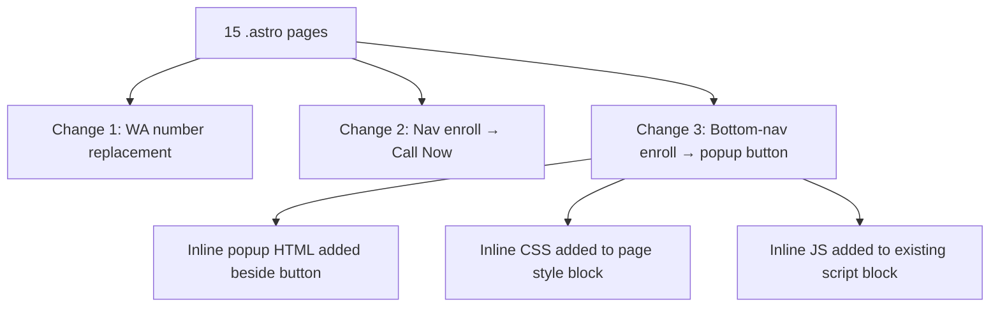
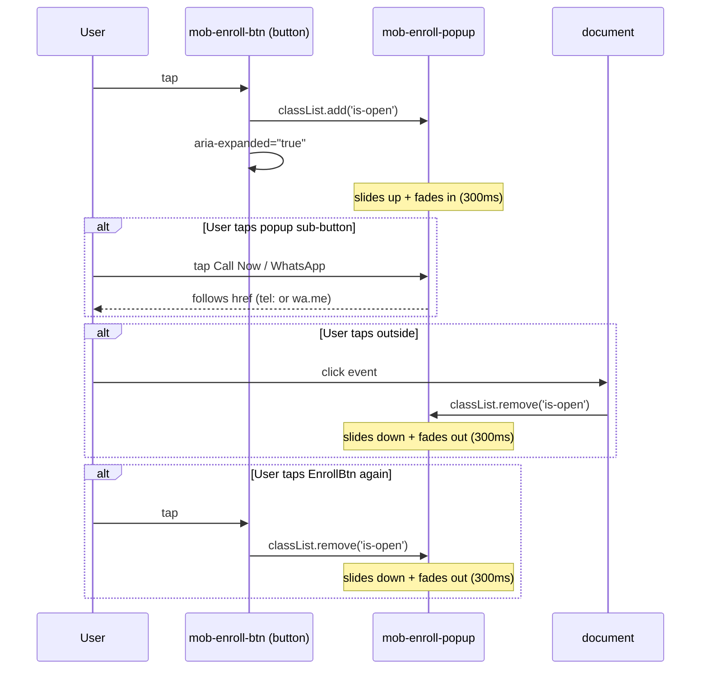

# Design Document: contact-button-updates

## Overview

Three coordinated HTML/CSS/JS edits applied uniformly across all 15 `.astro` pages under `src/pages/`. The changes update the WhatsApp contact number site-wide, convert the top-nav "Enroll Now" button into a direct phone-call button, and replace the mobile bottom-nav centre enroll anchor with a `<button>` that toggles an animated two-option popup (Call Now / WhatsApp). All pages share an identical structure, so the same diff pattern applies to every file.

---

## Architecture



All changes are purely in-file string replacements. No new files, no shared components, no build-time imports are introduced.

---

## Change 1 — WhatsApp Number Replacement

### Pattern

Every `href` that contains `wa.me/919995879404` is replaced with `wa.me/918289887322`. The URL-encoded message query string (`?text=…`) is preserved verbatim.

### Affected elements per page

| Element class | Notes |
|---|---|
| `hero__enroll-btn` | Top-nav anchor (also modified by Change 2) |
| `hero__cta` (non-outline) | Hero section primary CTA |
| `mob-course-card__enroll` | Each course card inside the courses bottom sheet |
| `mob-sheet__enroll-cta` | Placements bottom sheet enroll CTA |
| `mob-bottom-nav__enroll` | Bottom-nav centre button (also modified by Change 3) |

### Regex / find-and-replace pattern

```
Find:    wa\.me/919995879404
Replace: wa.me/918289887322
```

This is a plain substring replacement — no regex flags needed. It is safe to apply globally within each file because the old number appears only in `href` attributes.

---

## Change 2 — Top-Nav "Enroll Now" → "Call Now"

### Before (current HTML, condensed)

```html
<a href="https://wa.me/919995879404?text=..."
   class="hero__enroll-btn"
   target="_blank"
   rel="noopener noreferrer"
   data-astro-cid-7nmnspah>
Enroll Now
</a>
```

### After

```html
<a href="tel:+919958873874"
   class="hero__enroll-btn"
   data-astro-cid-7nmnspah>
Call Now
</a>
```

### Rules

- `href` → `tel:+919958873874`
- Text content → `Call Now`
- Remove `target="_blank"`
- Remove `rel="noopener noreferrer"`
- Retain `class="hero__enroll-btn"` and all `data-astro-cid-*` attributes unchanged

### Find-and-replace pattern (exact string match)

Because the pages are minified into a single line, the safest approach is to match the full attribute sequence. The `hero__enroll-btn` anchor appears exactly once per page.

```
Find:
  href="https://wa.me/919995879404?text=Hi%2C%20I%27m%20interested%20in%20enrolling%20in%20an%20Industrial%20Automation%20course%20at%20SMECLabs.%20Please%20share%20more%20details." class="hero__enroll-btn" target="_blank" rel="noopener noreferrer"

Replace:
  href="tel:+919958873874" class="hero__enroll-btn"
```

Then separately replace the text node:

```
Find (within the hero__enroll-btn anchor):    Enroll Now
Replace:                                       Call Now
```

> Note: Course pages use a different `?text=` value (course-specific message). The `href` prefix `https://wa.me/919995879404` is common to all, so the WA number replacement from Change 1 handles the href update; only the `target`, `rel`, and text need separate treatment for Change 2.

**Practical approach**: For each page, match the `hero__enroll-btn` anchor opening tag and replace the full attribute block, then replace the inner text. A per-page script (see Implementation Strategy) handles this cleanly.

---

## Change 3 — Bottom-Nav Centre Button → Animated Popup

### Current HTML (bottom-nav enroll, condensed)

```html
<!-- Centre Enroll CTA -->
<a href="https://wa.me/919995879404?text=..."
   class="mob-bottom-nav__enroll"
   target="_blank"
   rel="noopener noreferrer"
   aria-label="Enroll Now on WhatsApp"
   data-astro-cid-7nmnspah>
  <span class="mob-bottom-nav__enroll-bubble" data-astro-cid-7nmnspah>
    [WhatsApp SVG]
  </span>
  <span data-astro-cid-7nmnspah>Enroll</span>
</a>
```

### New HTML (replaces the `<a>` entirely)

```html
<!-- Centre Enroll CTA -->
<div class="mob-enroll-wrap" data-astro-cid-7nmnspah>
  <div class="mob-enroll-popup" id="mob-enroll-popup" role="dialog"
       aria-label="Contact options" aria-hidden="true"
       data-astro-cid-7nmnspah>
    <a href="tel:+919958873874"
       class="mob-enroll-popup__btn mob-enroll-popup__btn--call"
       data-astro-cid-7nmnspah>
      <svg viewBox="0 0 24 24" fill="none" stroke="currentColor"
           stroke-width="2" stroke-linecap="round" stroke-linejoin="round"
           aria-hidden="true" width="18" height="18"
           data-astro-cid-7nmnspah>
        <path d="M22 16.92v3a2 2 0 0 1-2.18 2 19.79 19.79 0 0 1-8.63-3.07
                 19.5 19.5 0 0 1-6-6 19.79 19.79 0 0 1-3.07-8.67A2 2 0 0 1
                 4.11 2h3a2 2 0 0 1 2 1.72c.127.96.361 1.903.7 2.81a2 2 0 0
                 1-.45 2.11L8.09 9.91a16 16 0 0 0 6 6l1.27-1.27a2 2 0 0 1
                 2.11-.45c.907.339 1.85.573 2.81.7A2 2 0 0 1 22 16.92z"
              data-astro-cid-7nmnspah></path>
      </svg>
      Call Now
    </a>
    <a href="https://wa.me/918289887322?text=Hi%2C%20I%27m%20interested%20in%20enrolling%20at%20SMECLabs.%20Please%20share%20more%20details."
       class="mob-enroll-popup__btn mob-enroll-popup__btn--wa"
       target="_blank" rel="noopener noreferrer"
       data-astro-cid-7nmnspah>
      <svg viewBox="0 0 24 24" fill="currentColor" aria-hidden="true"
           width="18" height="18" data-astro-cid-7nmnspah>
        <path d="M17.472 14.382c-.297-.149-1.758-.867-2.03-.967-.273-.099-.471-.148-.67.15-.197.297-.767.966-.94 1.164-.173.199-.347.223-.644.075-.297-.15-1.255-.463-2.39-1.475-.883-.788-1.48-1.761-1.653-2.059-.173-.297-.018-.458.13-.606.134-.133.298-.347.446-.52.149-.174.198-.298.298-.497.099-.198.05-.371-.025-.52-.075-.149-.669-1.612-.916-2.207-.242-.579-.487-.5-.669-.51-.173-.008-.371-.01-.57-.01-.198 0-.52.074-.792.372-.272.297-1.04 1.016-1.04 2.479 0 1.462 1.065 2.875 1.213 3.074.149.198 2.096 3.2 5.077 4.487.709.306 1.262.489 1.694.625.712.227 1.36.195 1.871.118.571-.085 1.758-.719 2.006-1.413.248-.694.248-1.289.173-1.413-.074-.124-.272-.198-.57-.347z"></path>
        <path d="M12 0C5.373 0 0 5.373 0 12c0 2.123.554 4.118 1.528 5.855L.057 23.428a.75.75 0 0 0 .916.916l5.573-1.471A11.943 11.943 0 0 0 12 24c6.627 0 12-5.373 12-12S18.627 0 12 0zm0 22c-1.907 0-3.693-.504-5.23-1.385l-.374-.217-3.875 1.023 1.023-3.875-.217-.374A9.953 9.953 0 0 1 2 12C2 6.477 6.477 2 12 2s10 4.477 10 10-4.477 10-10 10z"></path>
      </svg>
      WhatsApp
    </a>
  </div>
  <button class="mob-bottom-nav__enroll"
          id="mob-enroll-btn"
          aria-label="Contact options"
          aria-expanded="false"
          data-astro-cid-7nmnspah>
    <span class="mob-bottom-nav__enroll-bubble" data-astro-cid-7nmnspah>
      [WhatsApp SVG — unchanged from original]
    </span>
    <span data-astro-cid-7nmnspah>Enroll</span>
  </button>
</div>
```

> The WhatsApp SVG inside the bubble is kept identical to the original so the button's visual appearance is unchanged when the popup is closed.

> The `?text=` query string on the Popup_WA_Btn uses the generic enrollment message. Course pages use their own course-specific message — the per-page replacement script substitutes the correct encoded text for each page.

### Popup CSS (added to the page's existing `<style>` block)

```css
/* ── Enroll popup ─────────────────────────────────────────── */
.mob-enroll-wrap {
  position: relative;
  display: contents; /* preserves bottom-nav flex layout */
}
.mob-enroll-popup {
  position: absolute;
  bottom: calc(100% + 10px);
  left: 50%;
  transform: translateX(-50%) translateY(8px);
  opacity: 0;
  pointer-events: none;
  display: flex;
  flex-direction: column;
  gap: 8px;
  background: #fff;
  border-radius: 14px;
  padding: 10px;
  box-shadow: 0 8px 32px rgba(0,0,0,.18), 0 2px 8px rgba(0,0,0,.10);
  min-width: 160px;
  z-index: 10000;
  transition: opacity 300ms ease, transform 300ms ease;
}
.mob-enroll-popup.is-open {
  opacity: 1;
  transform: translateX(-50%) translateY(0);
  pointer-events: auto;
}
.mob-enroll-popup__btn {
  display: flex;
  align-items: center;
  gap: 8px;
  padding: 10px 14px;
  border-radius: 10px;
  font-size: .875rem;
  font-weight: 600;
  text-decoration: none;
  white-space: nowrap;
}
.mob-enroll-popup__btn--call {
  background: linear-gradient(135deg, #2d318f, #1565c0);
  color: #fff;
}
.mob-enroll-popup__btn--wa {
  background: #25d366;
  color: #fff;
}
.mob-bottom-nav__enroll[aria-expanded="true"] .mob-bottom-nav__enroll-bubble {
  background: linear-gradient(135deg, #1565c0, #0d9488);
}
@media (prefers-reduced-motion: reduce) {
  .mob-enroll-popup {
    transition: none;
  }
}
```

**Why `display: contents` on the wrapper**: The bottom nav is a flex container. Wrapping the `<a>` in a `<div>` would break the flex layout unless the wrapper is invisible to the flex algorithm. `display: contents` makes the wrapper a transparent box so the `<button>` participates in the flex layout exactly as the original `<a>` did.

**Positioning**: `position: absolute; bottom: calc(100% + 10px)` places the popup above the button with a 10 px gap. `left: 50%; transform: translateX(-50%)` centres it horizontally over the button. The wrapper needs `position: relative` — but since `display: contents` removes the box, the `position: relative` is placed on the `<button>` itself (see JS section).

> Revised approach: Rather than relying on `display: contents` + `position: relative` on the wrapper (which has cross-browser edge cases), the popup is positioned relative to the `<button>` directly. The `<div class="mob-enroll-wrap">` uses `position: relative` and `display: inline-flex` (or is replaced by a `position: relative` wrapper that does not disrupt flex). See the Implementation Notes below.

### Revised wrapper approach

To avoid `display: contents` positioning issues, the wrapper uses `position: relative` and is sized to match the button:

```css
.mob-enroll-wrap {
  position: relative;
  display: flex;
  align-items: center;
  justify-content: center;
}
```

The bottom nav flex container already uses `align-items` and `justify-content` on its children; adding a flex wrapper around the centre button is safe because the nav uses `display: flex; justify-content: space-around` (or similar). The wrapper takes the same flex slot as the original `<a>`.

### Popup JS (appended inside the existing `<script type="module">` block)

The existing script block already manages `mob-overlay`, bottom sheets, and the FAQ accordion. The popup JS is appended at the end of that same block, following the same pattern.

```javascript
// ── Enroll popup ──────────────────────────────────────────
(function () {
  const enrollBtn = document.getElementById('mob-enroll-btn');
  const enrollPopup = document.getElementById('mob-enroll-popup');
  if (!enrollBtn || !enrollPopup) return;

  function openPopup() {
    enrollPopup.classList.add('is-open');
    enrollPopup.setAttribute('aria-hidden', 'false');
    enrollBtn.setAttribute('aria-expanded', 'true');
  }

  function closePopup() {
    enrollPopup.classList.remove('is-open');
    enrollPopup.setAttribute('aria-hidden', 'true');
    enrollBtn.setAttribute('aria-expanded', 'false');
  }

  enrollBtn.addEventListener('click', function (e) {
    e.stopPropagation();
    enrollPopup.classList.contains('is-open') ? closePopup() : openPopup();
  });

  // Close on outside tap
  document.addEventListener('click', function (e) {
    if (
      enrollPopup.classList.contains('is-open') &&
      !enrollPopup.contains(e.target) &&
      e.target !== enrollBtn
    ) {
      closePopup();
    }
  });

  // Prevent clicks inside popup from bubbling to document
  enrollPopup.addEventListener('click', function (e) {
    e.stopPropagation();
  });
})();
```

### Sequence diagram — popup interaction



---

## Components and Interfaces

### Component 1: Nav Enroll Button (`hero__enroll-btn`)

**Purpose**: Top-nav call-to-action that lets users initiate a phone call directly.

**Interface** (HTML element contract):
```html
<a href="tel:+919958873874"
   class="hero__enroll-btn"
   data-astro-cid-*>
  Call Now
</a>
```

**Responsibilities**:
- Render the "Call Now" label in the top navigation bar
- Trigger the device's native phone dialler on tap/click
- Retain existing visual styling via `hero__enroll-btn` class

---

### Component 2: Enroll Popup (`mob-enroll-popup`)

**Purpose**: Animated overlay that presents two contact options above the bottom-nav centre button.

**Interface** (HTML element contract):
```html
<div class="mob-enroll-popup"
     id="mob-enroll-popup"
     role="dialog"
     aria-label="Contact options"
     aria-hidden="true">
  <a class="mob-enroll-popup__btn mob-enroll-popup__btn--call"
     href="tel:+919958873874">Call Now</a>
  <a class="mob-enroll-popup__btn mob-enroll-popup__btn--wa"
     href="https://wa.me/918289887322?text=..."
     target="_blank" rel="noopener noreferrer">WhatsApp</a>
</div>
```

**State**:
- Hidden: `aria-hidden="true"`, no `.is-open` class, `opacity: 0`, `pointer-events: none`
- Visible: `aria-hidden="false"`, `.is-open` class, `opacity: 1`, `pointer-events: auto`

**Responsibilities**:
- Slide up and fade in when opened (300 ms, or instant with `prefers-reduced-motion`)
- Slide down and fade out when closed
- Contain exactly two sub-buttons: Call Now and WhatsApp
- Position itself above the trigger button without being obscured

---

### Component 3: Bottom-Nav Enroll Button (`mob-bottom-nav__enroll`)

**Purpose**: Centre button in the mobile bottom navigation bar that toggles the Enroll Popup.

**Interface** (HTML element contract):
```html
<button class="mob-bottom-nav__enroll"
        id="mob-enroll-btn"
        aria-label="Contact options"
        aria-expanded="false"
        data-astro-cid-*>
  <span class="mob-bottom-nav__enroll-bubble">[WhatsApp SVG]</span>
  <span>Enroll</span>
</button>
```

**State**:
- Closed: `aria-expanded="false"`, bubble uses default gradient
- Open: `aria-expanded="true"`, bubble uses active gradient (visual indicator)

**Responsibilities**:
- Toggle the Enroll Popup open/closed on each tap
- Communicate open/closed state via `aria-expanded`
- Provide visual feedback when popup is open

---

## Data Models

### Contact constants (per page)

| Constant | Value |
|---|---|
| New WhatsApp number | `918289887322` |
| Call number | `+919958873874` |
| Old WhatsApp number (to remove) | `919995879404` |

### Per-page WA message text

Each page has its own URL-encoded `?text=` value on the `mob-bottom-nav__enroll` (now `mob-enroll-popup__btn--wa`) and other WA links. The number replacement is number-only; the message text is preserved. The popup WA button uses the same message text that was on the original `mob-bottom-nav__enroll` anchor for that page.

---

## Correctness Properties

These properties must hold for every one of the 15 pages after the update is applied.

### Property 1: No old WA number remains

For all pages P in the 15-page set: the file content of P does not contain the substring `wa.me/919995879404`.

**Validates: Requirements 1.1, 1.2, 4.2**

### Property 2: Nav button is a tel link

For all pages P: the element with `class="hero__enroll-btn"` has `href="tel:+919958873874"` and does not contain `target="_blank"` or `rel="noopener noreferrer"`.

**Validates: Requirements 2.1, 2.6, 2.7**

### Property 3: Nav button text is "Call Now"

For all pages P: the visible text content of the `hero__enroll-btn` element is `Call Now` (not `Enroll Now`).

**Validates: Requirements 2.2, 4.3**

### Property 4: Bottom-nav enroll is a button element

For all pages P: the element with `class="mob-bottom-nav__enroll"` is a `<button>` tag, not an `<a>` tag, and does not have an `href` attribute.

**Validates: Requirements 3.11, 4.4**

### Property 5: Popup contains exactly two sub-buttons with correct hrefs

For all pages P: `#mob-enroll-popup` contains exactly one element with class `mob-enroll-popup__btn--call` (href = `tel:+919958873874`) and exactly one element with class `mob-enroll-popup__btn--wa` (href contains `wa.me/918289887322`).

**Validates: Requirements 3.2, 3.3, 3.4**

### Property 6: Popup WA button opens in new tab safely

For all pages P: the `.mob-enroll-popup__btn--wa` element has both `target="_blank"` and `rel="noopener noreferrer"`.

**Validates: Requirements 3.4**

### Property 7: Popup toggle behaviour is correct

For all pages P: the JS in the page's script block contains `mob-enroll-btn` and `mob-enroll-popup` identifiers, and the popup element starts with `aria-hidden="true"` and `aria-expanded` is absent from the popup (it is on the button).

**Validates: Requirements 3.1, 3.6, 3.11**

### Property 8: No unrelated content is altered

For all pages P: the total character count of the file after applying all three changes differs from the original only by the expected delta (removed old anchor, added new wrapper + popup HTML + CSS + JS).

**Validates: Requirements 4.5**

---

## Implementation Strategy

### Approach: per-file string replacement script

Because all 15 pages are large single-line minified files, a Node.js or PowerShell script is the most reliable approach. Manual editing risks introducing whitespace or encoding errors.

**Script responsibilities per file:**

1. **Change 1** — Global replace `wa.me/919995879404` → `wa.me/918289887322`
2. **Change 2** — Replace the `hero__enroll-btn` anchor's opening tag attributes and inner text:
   - Match: `href="https://wa.me/918289887322?text=..." class="hero__enroll-btn" target="_blank" rel="noopener noreferrer"`  
     (after Change 1 has already updated the number)
   - Replace with: `href="tel:+919958873874" class="hero__enroll-btn"`
   - Replace inner text `Enroll Now` → `Call Now` (scoped to the `hero__enroll-btn` anchor)
3. **Change 3** — Replace the entire `<!-- Centre Enroll CTA --> <a ... </a>` block with the new `<div class="mob-enroll-wrap">...</div>` block
4. **CSS** — Append the popup CSS to the page's existing `<style>` block (before the closing `</style>` tag of the last inline style block)
5. **JS** — Append the popup JS before the closing `</script>` tag of the bottom-nav script block (identified by the presence of `mob-overlay` and `mob-bottom-nav__item`)

### Ordering

Changes must be applied in this order per file:
1. WA number replacement (Change 1) — so Change 2's find pattern uses the new number
2. Nav button update (Change 2)
3. Bottom-nav popup replacement (Change 3) — includes CSS and JS additions

### Identifying the correct `<script>` block

Each page has multiple `<script type="module">` blocks. The target block for JS injection is the one containing `mob-overlay` (the bottom-nav interaction script). It is always the last `<script>` block before `<main class="desktop-only">`.

---

## Error Handling

| Scenario | Handling |
|---|---|
| `mob-enroll-btn` or `mob-enroll-popup` not found in DOM | Early return in IIFE — no error thrown |
| User taps popup sub-button | `stopPropagation` on popup prevents the document click handler from firing and immediately closing the popup |
| `prefers-reduced-motion: reduce` | `transition: none` on `.mob-enroll-popup` — popup appears/disappears instantly |
| Popup obscured by other elements | `z-index: 10000` on `.mob-enroll-popup` — above the bottom nav (`z-index` typically ~100) and all page content |

---

## Testing Strategy

### Manual verification checklist (per page)

- [ ] No `wa.me/919995879404` remains in the file
- [ ] `hero__enroll-btn` has `href="tel:+919958873874"`, text "Call Now", no `target` or `rel`
- [ ] `mob-bottom-nav__enroll` is a `<button>` (not `<a>`)
- [ ] Tapping the enroll button opens the popup (slide-up animation)
- [ ] Tapping "Call Now" in popup initiates a phone call
- [ ] Tapping "WhatsApp" in popup opens `wa.me/918289887322` in a new tab
- [ ] Tapping outside the popup closes it
- [ ] Tapping the enroll button again closes the popup
- [ ] With `prefers-reduced-motion: reduce`, popup appears/disappears instantly
- [ ] Popup is not obscured by other elements
- [ ] All other page functionality (bottom sheets, FAQ, video popup, scroll reveal) is unaffected

### Property-based / automated checks

A post-apply validation script can assert:

```javascript
// For each of the 15 files:
assert(!content.includes('wa.me/919995879404'))
assert(content.includes('href="tel:+919958873874"'))
assert(!content.includes('class="hero__enroll-btn" target="_blank"'))
assert(content.includes('id="mob-enroll-btn"'))
assert(content.includes('id="mob-enroll-popup"'))
assert(content.includes('mob-enroll-popup__btn--call'))
assert(content.includes('mob-enroll-popup__btn--wa'))
```

---

## Security Considerations

- `tel:` links do not require `rel="noopener noreferrer"` — removed correctly
- The new WhatsApp popup button retains `target="_blank" rel="noopener noreferrer"` to prevent tab-napping
- No user input is processed; all hrefs are static strings

---

## Dependencies

No new npm packages or external libraries. All changes are vanilla HTML, CSS, and JavaScript inline within the existing Astro page files.
